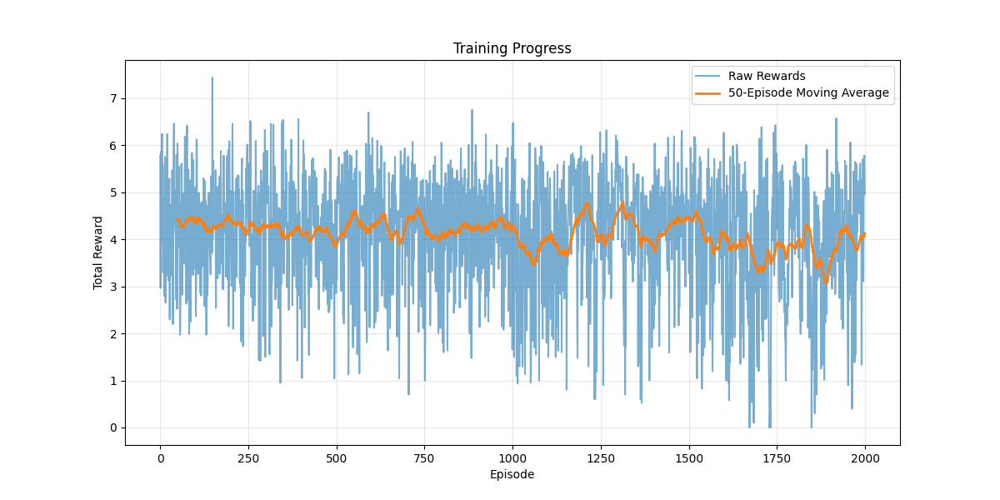

# Anime Recommendation System with Deep Reinforcement Learning

A personalized **anime recommendation system** that utilizes **Deep Q-Learning (DQL)** and **Neural Networks** to generate personalized anime recommendations. This project is built with **PyTorch** and employs a **Deep Q-Network** for learning user preferences and an **Experience Replay** mechanism for stable training.

---

## Table of Contents

- [Overview](#overview)
- [Features](#features)
- [Installation](#installation)
- [Usage](#usage)
  - [Training](#training)
  - [Inference](#inference)
- [Project Structure](#project-structure)
- [Configuration](#configuration)
- [Results](#results)

---

## Overview

The goal of this project is to build a reinforcement learning system capable of providing personalized anime recommendations. The system trains on the **MyAnimeList dataset** and uses Deep Q-Learning to learn user preferences and generate recommendations.

### Key Workflow:
1. **User preference modeling** based on watch history and ratings
2. **Deep Q-Learning** to learn optimal recommendation strategies
3. **Experience replay** for stable training
4. **Reward system** incorporating multiple factors like ratings and genre preferences

---

## Features

- **Deep Q-Network** for learning recommendation strategies
- **Custom Environment** modeling the anime recommendation space
- **Experience Replay Buffer** for stable training
- **User Preference Modeling** based on watch history
- Support for configurable **training parameters**
- **Inference mode** to generate recommendations for specific users

---

## Installation

### Prerequisites

- Python 3.7 or higher
- PyTorch 1.9.0 or higher
- Other dependencies listed in `requirements.txt`

Clone the repository:
```bash
git clone  https://github.com/dixisouls/Anime_Recommender
cd Anime_Recommender
```

Install the required libraries:
```bash
pip install -r requirements.txt
```

---

## Usage

### Training

To train the recommendation model, run:
```bash
python train.py
```

Optional arguments:
```bash
--num_episodes       Number of training episodes (default: 1000)
--anime_path        Path to anime dataset (default: "data/anime.csv")
--ratings_path      Path to ratings dataset (default: "data/rating.csv")
```

Training configuration is handled in the `config.py` file. After training:
- Model checkpoints will be saved in the `saved_models/` directory
- Training logs will be stored in the `logs/anime_recommender.log` file
- Training progress plot will be saved in `plots/training_progress.png`

### Inference

To generate recommendations for a specific user:
```bash
python recommend.py
```
After the model is loaded it will ask for user ID to generate recommendation for that particular user.

The recommendations will be displayed with detailed information about each anime.

Example:
```
Enter user id: 9694
2025-01-27 18:15:37,163 - __main__ - INFO - Generating recommendations for user 9694...

Recommended Animes:
================================================================================

1. Salaryman Kintarou
----------------------------------------
Genre: Comedy, Drama, Seinen
Type: TV
Episodes: 20
Rating: 7.61/10
Members: 4,151

2. Love Colon
----------------------------------------
Genre: Hentai
Type: OVA
Episodes: 2
Rating: 6.51/10
Members: 1,970

3. Kiddy Grade
----------------------------------------
Genre: Action, Ecchi, Mecha, Sci-Fi, Super Power
Type: TV
Episodes: 24
Rating: 7.31/10
Members: 30,766

4. Pepsi Nex x 009 Re:Cyborg
----------------------------------------
Genre: Action, Comedy
Type: Movie
Episodes: 3
Rating: 5.27/10
Members: 135

5. Night Walker: Mayonaka no Tantei
----------------------------------------
Genre: Action, Comedy, Horror, Mystery, Vampire
Type: TV
Episodes: 12
Rating: 7.09/10
Members: 11,143
2025-01-27 18:15:37,209 - __main__ - INFO - Recommendations generated successfully!
````

---

## Project Structure
```
anime_recommender/
├── config/
│   └── config.py           # Configuration parameters
├── data/
│   ├── data_preprocessor.py # Data preprocessing utilities
│   ├── anime.csv           # Anime dataset
│   └── rating.csv          # User ratings dataset
├── models/
│   ├── dqn.py             # Deep Q-Network implementation
│   └── replay_memory.py    # Experience replay buffer
├── environment/
│   └── anime_env.py       # RL environment implementation
├── agents/
│   └── dql_agent.py       # DQL agent implementation
├── utils/
│   └── helpers.py         # Utility functions
├── logs/
│   └── anime_recommender.log # Application logs
├── saved_models/
│   ├── metadata.json      # Model metadata
│   └── anime_recommender_model.pth # Trained model
├── plots/
│   └── training_progress.png # Training visualization
├── train.py              # Training pipeline
├── recommend.py          # Recommendation script
└── README.md            # Project README file
```

---

## Configuration

You can customize various parameters in `config.py`:

- **Model Architecture**
  - `HIDDEN_SIZES`: Sizes of hidden layers [1024, 512, 256]
  - `DROPOUT_RATE`: Dropout rate for regularization

- **Training Parameters**
  - `BATCH_SIZE`: Size of training batch
  - `GAMMA`: Discount factor for future rewards
  - `EPS_START`: Starting epsilon for exploration
  - `EPS_END`: Final epsilon value
  - `EPS_DECAY`: Rate of epsilon decay
  - `TARGET_UPDATE`: Frequency of target network updates
  - `MEMORY_CAPACITY`: Size of replay memory
  - `LEARNING_RATE`: Learning rate for optimization

- **Environment Parameters**
  - `N_RECOMMENDATIONS`: Number of recommendations to generate

---

## Results

The system demonstrates effective learning of user preferences:

- **Training Progress**: The reward improves over time as the agent learns to make better recommendations
- **User Preferences**: The system learns to recommend anime based on:
  - User's rating history
  - Genre preferences
  - Anime popularity and ratings
  - Content diversity



To visualize training progress, check the generated plot at `plots/training_progress.png`.

---